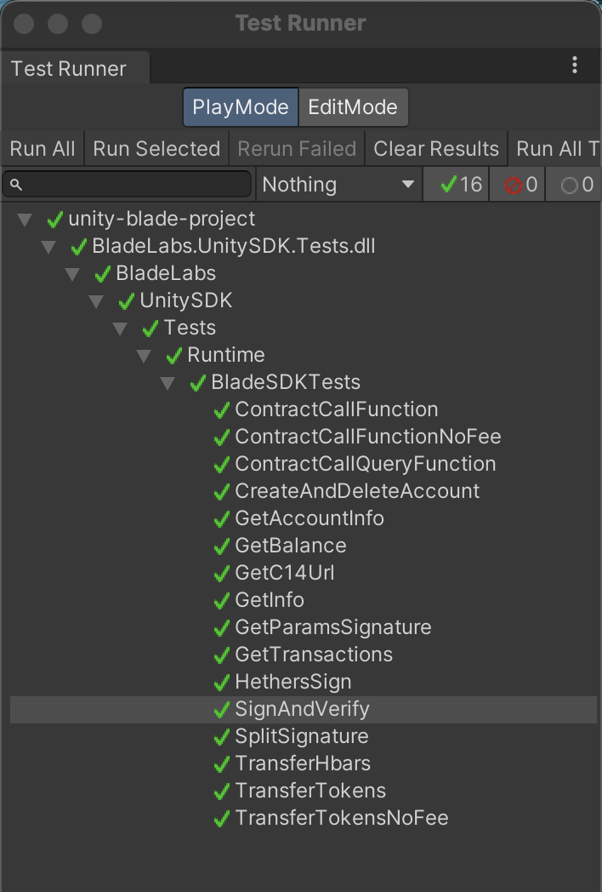

## Development

### Tests

Code covered with tests. To run it do this steps:

1. Enable tests for a package: https://docs.unity3d.com/Manual/cus-tests.html#tests
    - Open project manifest.json file
    - Add field testables. Should be similar to this: `"testables": ["io.bladelabs.unity-sdk"]`
2. In Unity go to Window -> General -> Test runner
3. In "PlayMode" tab press "RunAll"

### JS bundle

To update JS bundle do this:

* Clone `https://github.com/Blade-Labs/blade-sdk.js`
* Run `npm i`
* Run `npm run publish:unity`. It creates new branch `js/latest-build`
* Merge `js/latest-build` to your working branch

Also for local development you can set output of webpack directly to Plugin directory. 
To do that, in `./config/webpack.unity.js` set `output.path` to something similar to that `'/Users/gary/dev/unity/io.bladelabs.unity-sdk/Resources'`

### Backend for executing transactions 

Currently this is not part of BladeAPI, maybe in future

Check example of [transaction executor endpoint](tx-executor/index.js)

