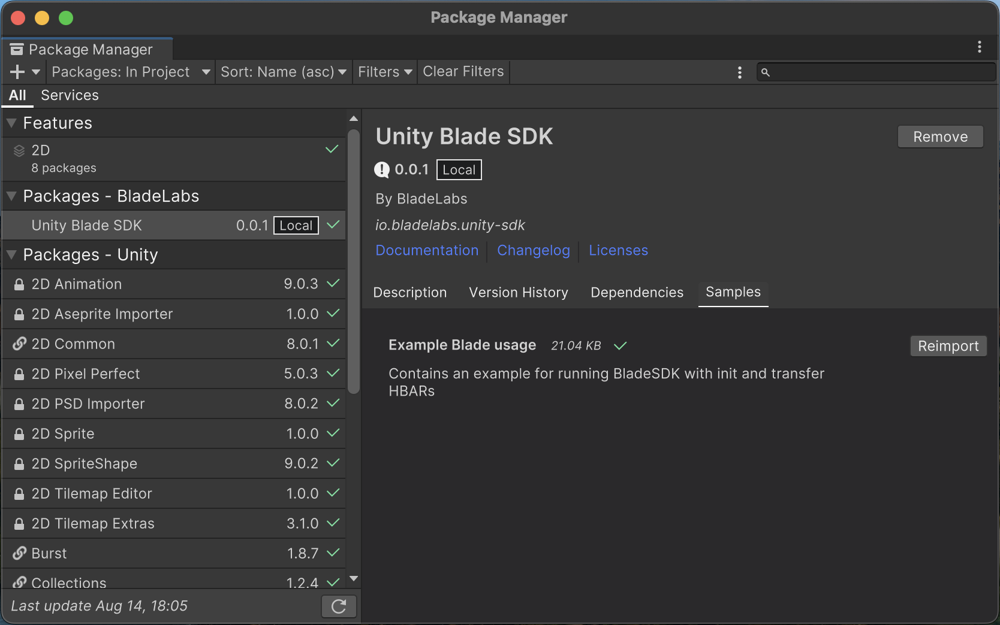

# Getting Started

## Requirements

* **Unity 2019.3+**
* **MacOS, Linux, Windows**


## Install

1. Open Unity
2. Goto menu Window > Package Manager 
3. Press Add button
4. Add package from git URL...
5. Put this repo url: `git@github.com:Blade-Labs/unity-blade.git`

## Examples

1. In Package Manager pick `Unity Blade SDK`
2. Open package Samples tab
3. Click import at `Example Blade usage` item
4. On Project navigator go to: Assets/Samples/Unity Blade SDK/0.0.1/Example Blade usage/Scenes
5. Open `RunBladeExample` scene
6. Play



## Add to existing project

To use BladeSDK you need to add reference to your .asmdef

1. Select your project .asmdef file
2. On Inpector tab go to `Assembly Definition References`
3. Click on `+`
4. Select `BladeLabs.UnitySDK`

## Usage

Before using BladeSDK you need to create instance. Put arguments to constructor like in example. It initialize Jint engine instance and attach all required handlers to interact. Avoid using multiple instances of BladeSDK.

```cs
using BladeLabs.UnitySDK;
using UnityEngine;

namespace YourProject {
class YourProjectClass : MonoBehaviour {
    private string apiKey = "ygUgCzRrs_yourDAppApiKey_5m8FjfPV3XVUeB";
    private Network network = Network.Testnet;
    private string dAppCode = "unitysdktest";

    async void Start() {
        BladeSDK bladeSdk = new BladeSDK(apiKey, network, dAppCode, SdkEnvironment.CI);

        // After init you can call any public method, e.g.:
        Debug.Log(
            await bladeSdk.getBalance("0.0.346533")
        );
    }
}
}
```
